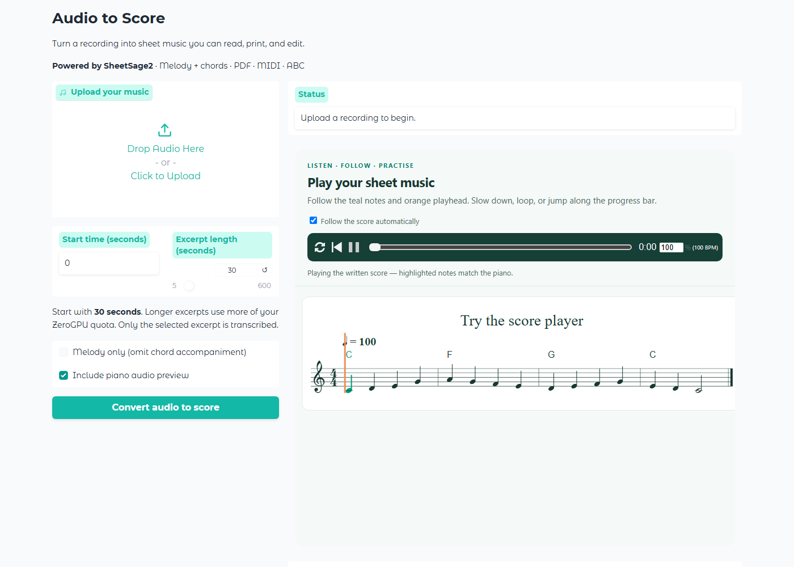

# Audio to Sheet Music — listen, follow, practise

Turn a music recording into sheet music with **SheetSage2**, then play the written
score and follow every note as it lights up. Built by [Reubencf](https://huggingface.co/Reubencf).

**[Open the app](https://huggingface.co/spaces/Reubencf/Audio-to-Score)** ·
**[Share feedback](https://huggingface.co/spaces/Reubencf/Audio-to-Score/discussions)**

## Try it in seconds

1. Press **Play** on the built-in example to try the player immediately.
2. Upload a recording and choose a **30-second excerpt** to start.
3. Select **Convert audio to score**.
4. Play your new score, follow the highlighted notes, and download your files.

## Listen and practise

- Teal note highlights and an orange playhead follow piano playback.
- Pause, restart, loop, change speed, or seek along the progress bar.
- Automatic scrolling follows the music through longer scores.
- Playback is synthesized from the written notation, rather than the original recording.

## Download and edit

Download **PDF sheet music, PNG score pages, editable ABC notation, MIDI parts**,
an optional **piano audio preview**, or everything in one ZIP.
The transcription produces a lead sheet with vocal and instrumental melodies and
chord symbols. Review notes and rhythm before performing.

## Access and availability

This public Space runs on **Hugging Face ZeroGPU**. The example player runs in your
browser; conversion uses available GPU capacity and Hugging Face usage quotas.
Requests run one at a time. Start with a short excerpt, especially after the Space
wakes up. Files are temporary and cleared after 24 hours or a restart.

If this helps you, like the Space and share the app link with other musicians.
Suggestions and transcription feedback are welcome in the Community tab.

## Credits and use

Powered by [SheetSage2](https://huggingface.co/m-a-p/SheetSage2) and
[MERT-v2-FullSong](https://huggingface.co/m-a-p/MERT-v2-FullSong).
Interactive notation and playback use [abcjs](https://github.com/paulrosen/abcjs).

The model is pinned to `eab522a8168e8b8b8c4856bf8609cd86198f01fe`.
Its parent revision is pinned by the upstream configuration.
Weights are licensed CC BY-NC 4.0; this app is for non-commercial use.
See [the model card](https://huggingface.co/m-a-p/SheetSage2) and its
third-party notices for details. Transcriptions may need musical correction.

## Deployment

Create a Gradio Space, select ZeroGPU, and upload these files. Hugging Face
provides the GPU only while conversion runs. No API key is required for the
currently public model repositories.
